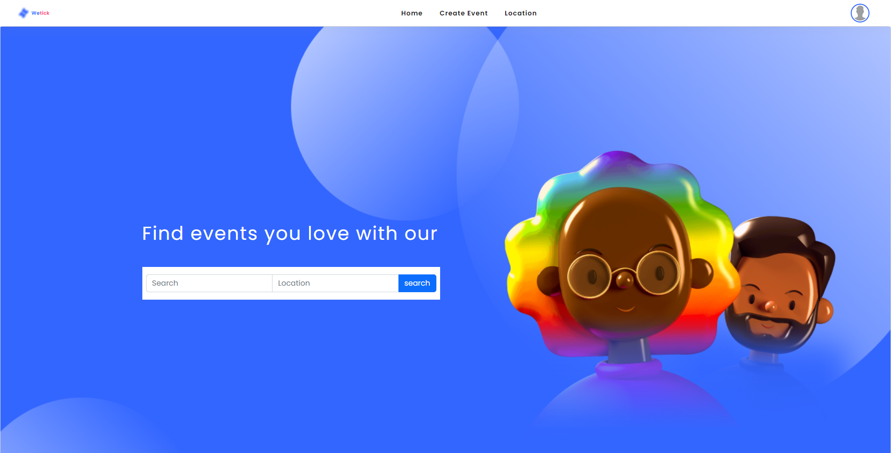
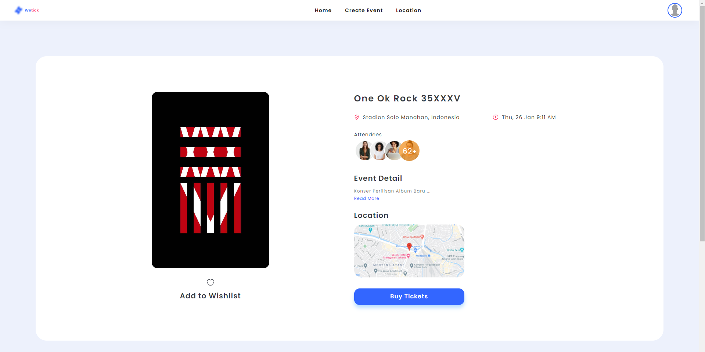
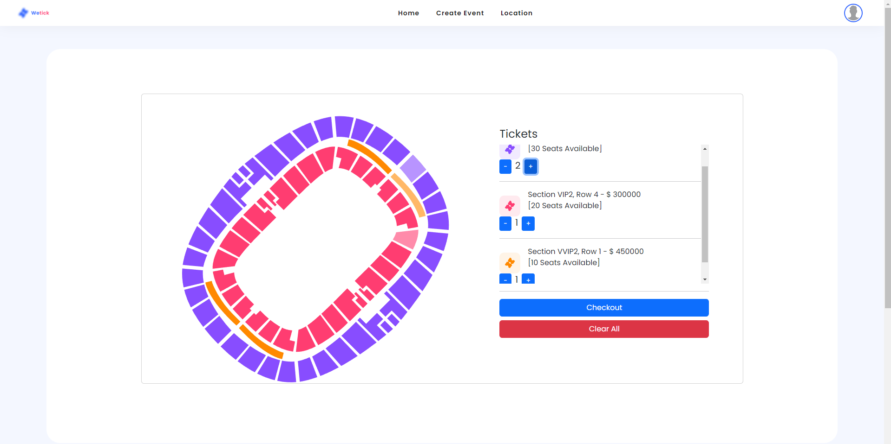

# Event Organizing Web App

[Application Demo](https://booked-event-organizing-frontend.vercel.app/) |
[Backend Repository](https://github.com/Fhmi00/booked-event-organizing-backend) |
[Author Profile](https://github.com/Fhmi00)

## 📝 Introduction

This web app is a simple event organizer that allows you to create, edit and delete events. You can also book events and manage your bookings.
As admin you can add, edit and delete events. As user you can book events and manage your bookings. The app has integrated authentication and authorization.
As payment method, it has integrated with seemingly secure payment method, Midtrans.

## 🔧 Built with

## 📜 Table of Contents

- [Introduction](#introduction)
- [Built with](#built-with)
- [Authors](#authors)

## 🤖 Prerequisites

- [Node.js](https://nodejs.org/en/)
- [Visual Studio Code](https://code.visualstudio.com/)
- [Bootstrap](https://getbootstrap.com/)
- [React](https://reactjs.org/)
- [Midtrans](https://midtrans.com/)

## 🙋‍♂️ Author

© [Muhammad Anisul Fahmi](https://github.com/Fhmi00) 2022
